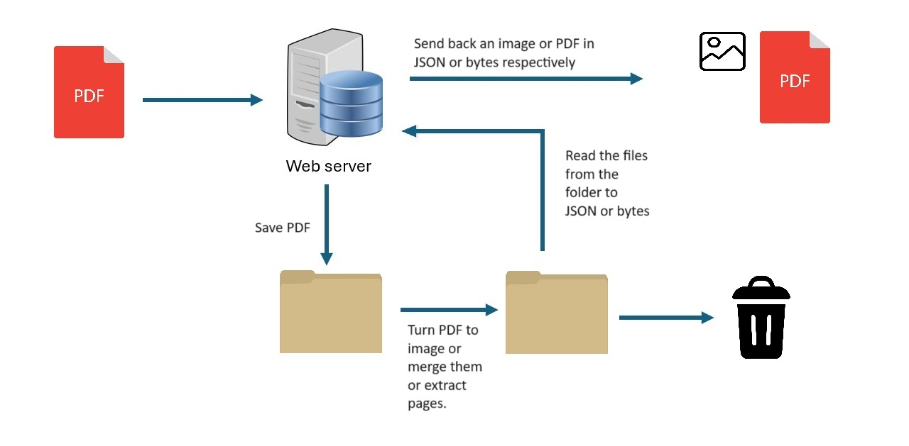

# Backend Server for PDF operations

This is a node js application that is responsible for:
- Converting pdf to images.
- Extracting pages from a pdf.
- Merging two pdf documents

## How to setup the server locally
Make sure you have node js installed.

- Create a temp folder in vr-documents\Backend.
- Create an upload folder in vr-documents\Backend.
- Open the command prompt (cmd) in the folder vr-documents\Backend.
- The path in the cmd should now end in vr-documents\Backend.
- Run npm install.
- Run npm start.

The server should now be running on port 8080

## VRDocs Server API Endpoints

The VRDocs server provides a set of RESTful API endpoints for managing PDF documents and converting them to images. The server can be accessed at http://vrdocs.make-diff.nl/.

### CORS Configuration

The server is configured to allow requests from specific origins. The allowed origin is `https://tychograpendaal.github.io`. This can be easily changed in server.js

### Endpoints

#### POST /upload-pdf

- Description: Uploads a PDF file to the server.
- Request Body: Raw PDF data.
- Headers:
  - `name`: The name of the file to be uploaded.
- Response: JSON object containing a message and the file path of the uploaded PDF.

#### POST /merge-pdfs

- Description: Merges two PDF files into one. Before you can merge you have to use the upload-pdf endpoint twice with the two pdf documents you want to merge.
- Headers:
  - `file1`: The name of the first PDF file.
  - `file2`: The name of the second PDF file.
- Response: The merged PDF file as raw pdf data.

#### POST /convert-pdf-to-image

- Description: Converts a PDF file to a series of images.
- Request Body: Raw PDF data.
- Response: JSON array containing base64 encoded strings of the converted images.

#### POST /extract-pages

- Description: Extracts specific pages from a PDF file.
- Request Body: Raw PDF data.
- Headers:
  - `Content-Type: application/pdf`
  - `x-pdf-pages`: A comma-separated list of page numbers to extract.
- Response: The extracted pages as a new PDF document, also in raw PDF data.

#### GET /

- Description: Default endpoint for the server.
- Response: A simple greeting message.

### Security

All endpoints are protected with API key authentication. The API key must be included in the request header as `X-API-Key`.

### Testing

The server includes a suite of automated tests to ensure the functionality of all endpoints. Tests are written using `chai` and `chai-http`.

### Notes

- The server is configured to handle raw PDF data with a limit of 50MB. However the nginx on the linux server only accepts 20MB.
- Temporary files created during the conversion process are cleaned up after use.
- The server is deployed on Google App Engine and can be scaled according to demand.

### Communication Diagram

