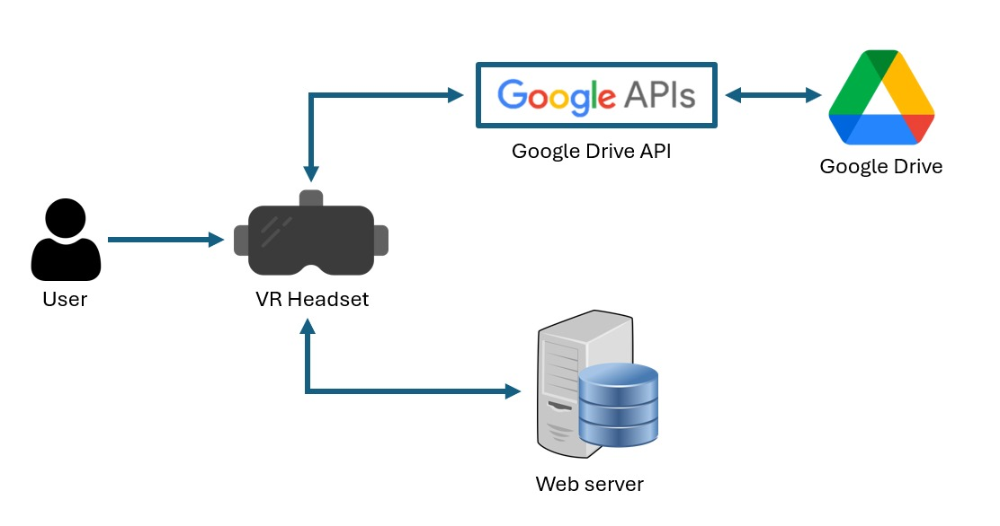
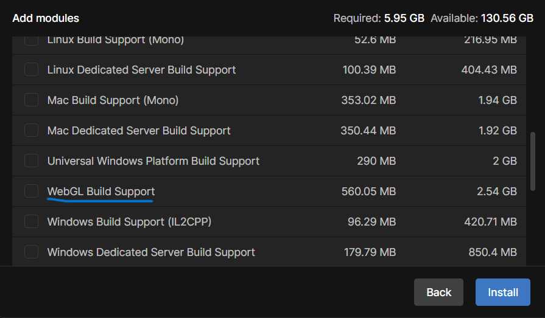
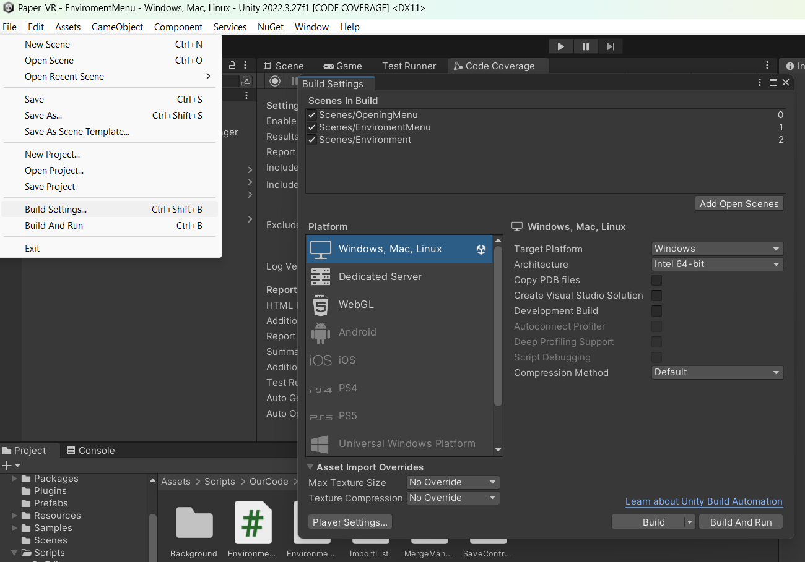
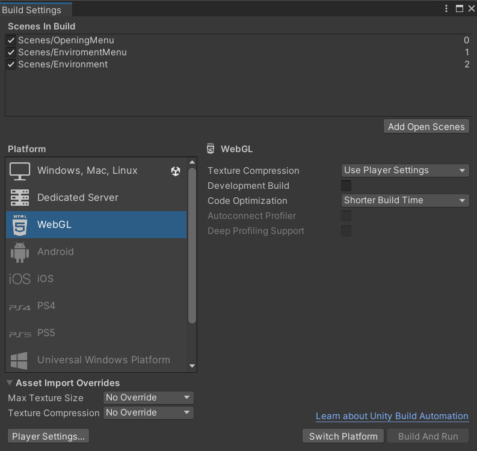

# Paper VR

## Description
Paper VR is an application that allows the user to work with PDF documents in virtual reality (VR). It uses the Google Drive of the user as its storage system. The user can create multiple so-called environments where they can import documents. Different environments equal different workspaces which can be customized to the user's liking. In an environment documents can be imported and moved around by the user. The user can also duplicate, split, merge, delete and export these 'floating documents'. The exported floating documents can be found in the users Google Drive, this way they can share it with other people.

The final build application is a website that communicates with a server and a google drive api like this:

## Badges

## Visuals

## Installation
- To install this project you first pull this repository and then you open it with Unity Hub using version 2022.2.27f1. Download the webGL build support. 

You only need to open this project in the Unity Editor and you are ready to go.
- To set up the google drive API take a look [here](GoogleReadMe.md).
- To use the backend server you need to open the command prompt and go to the backend path. Then you enter npm install and npm start. For more information look [here](Backend\README.md).
- Download Quest Link [here](https://www.meta.com/en-gb/help/quest/articles/headsets-and-accessories/oculus-rift-s/install-app-for-link/) and install it. This is needed to connect your VR headset to your PC.
- Enable Quest Link on your VR headset and connect to your PC.
- After, press the play button in the Unity Editor to start up the application. (When running the application in the unity editor make sure the build support in build settings is Windows, Mac, Linux)

# How to use the application on the web
To use the application on the web inside of the VR headset you need to first build the application. You can build it by going to `File -> Build Settings`.

Then press the WebGL button (If it is gray you need to download WebGL build support in unity hub see [Installation](#installation)) and press the switch platforms button.

Then press the build button, choose a folder to build and then upload the build to a website. In our case we used "https://tychograpendaal.github.io/webxr/" and "https://tychograpendaal.github.io/webxr-main/". Make sure the website is https otherwise it won't work.

When the website is online you can connect to it by going to the url inside of the standard browser. Make sure you allow pop ups. Then it will open a popup where you can login and then you can use the application inside of your VR headset.

## Usage
You are able to duplicate, delete, extract and merge any number of pages of a document.

You are able to import documents from your drive and export documents back.

You are able to save and share environments.

You are able to work in AR.

## Roadmap
There are some plans in the future about how we can improve this application, some of them are:
- Support for multiplayer where multiple people can work in the same environment.
- The addition of music or calming sounds to environments.
- The ability to easily switch between VR and AR.
- Support different cloud storages, e.g. OneDrive or Dropbox.

## Authors and acknowledgment
The following people contributed to the project:

Willem Dieleman, Tycho Grapendaal, Jochem van Paridon, Ruben Schnell & Pjotr Schram

Special thanks to Ana Băltăreţu, Petr Kellnhofer and Rutger Kramer.

## License
(c) Make-Diff BV. All rights reserved.

## Unity License
We use the Unity Personal plan. Unity Personal is for individuals and small organizations with less than $100K of revenue and funds raised in the last 12 months. The license can be upgraded to Unity Pro. For more information about the pricing, see [here](https://unity.com/products/pricing-updates).

## Project status
Depending on the outcome, Make-Diff BV will likely continue with the project, but on a fork of this repository.
